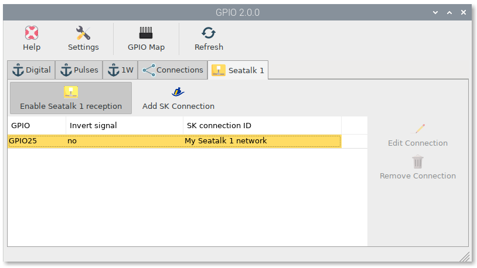

Seatalk-1
#########

Hardware
********

Using the hardware below:

https://www.amazon.com/dp/B07YJL3MQQ

First, remove the resistor on the input side and replace with a 10K, alternatively, you can add a 4.7K ohm resistor in line with the ground connection

Then connect the Seatalk Data (yellow) wire to the input + and the Seatalk Ground (black) wire to the Input -

On the opposite side connect 3.3V and ground from the Pi to VCC and GND respectively and connect the Output to a previously unused GPIO pin - for example Pin 7, which is GPIO 4. 

GPIO App
********

Go into settings (--> Openplotter -->Settings) and ensure that the GPIO App is installed and the latest

In the GPIO App, go to the Seatalk 1 tab and click on "Add SK Connection".  In the dialog box add the required information and then press the "Enable Seatalk 1 reception" button.  Pick the GPIO pin you are using (I was originally using GPIO 25 and later changed to GPIO 4 as the CAN Hat uses 25)

